# Practica 2.2
# Autenticación en Nginx

## Paquetes necesarios.

Tenemos que empezar comprobando que tenemos el paquete para utilizar ssl y crear así contraseñas:

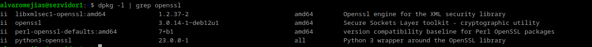

## Creación de usuarios y contraseñas.

Y ahora, creamos los usuarios:

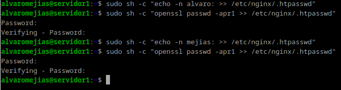

*Nota: Es muy importante poner ":" al final del nombre del usuario.*

Y con el comando `cat /etc/nginx/.htpasswd` podemos comprobar que están bien creados:

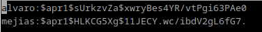

## Configurando el servidor.

Tenemos que editar el archivo `/etc/nginx/sites-available/nombredenuestraweb` y añadir lo siguiente:

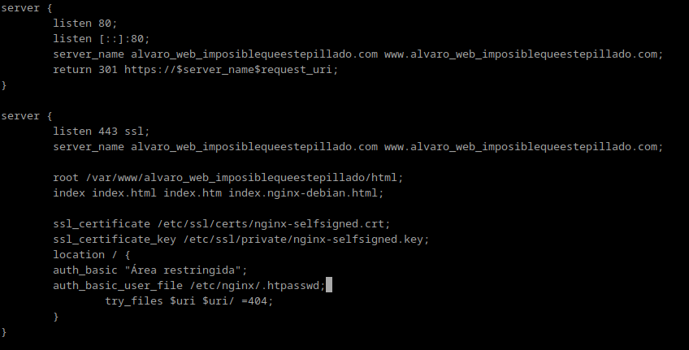

Tras esto, reiniciamos el servicio de nginx:

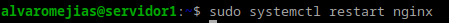

## Probando la nueva configuración

Para comprobar que todo funciona correctamente, intentamos acceder al sitio web desde nuestra máquina anfitriona:

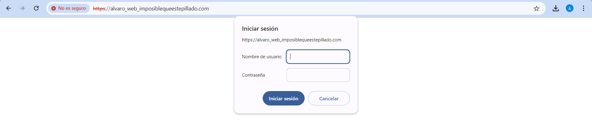

Efectivamente, nos pide autenticarnos, y al hacerlo correctamente nos permite acceder.

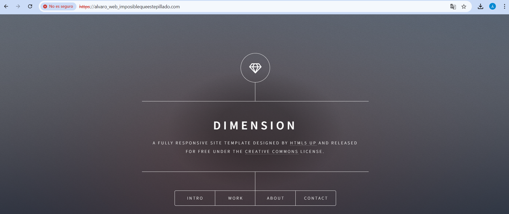

En caso de no autenticarnos correctamente:

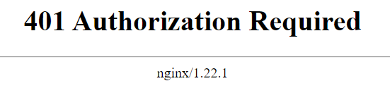

## Tareas

### Intenta entrar primero con un usuario erróneo y luego con otro correcto. Puedes ver todos los sucesos y registros en los logs access.log y error.log.

Aquí se adjunta una captura de `access.log` y otra de `error.log`:

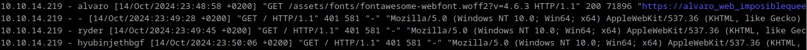

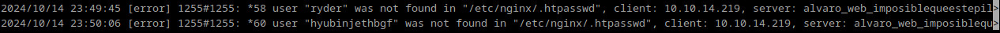

### Borra las dos líneas que hacen referencia a la autenticación básica en el location del directorio raíz. Tras ello, añade un nuevo location debajo con la autenticación básica para el archivo/sección contact.html únicamente.

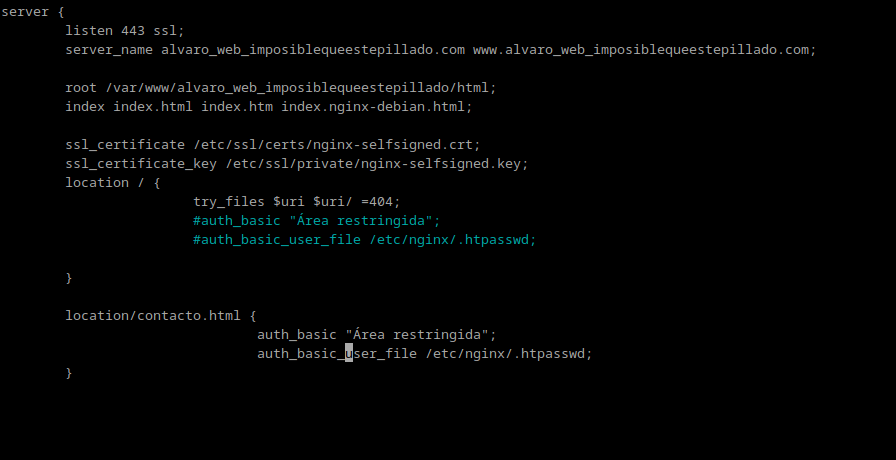

Como se puede ver en la URL, intentando acceder a `contacto.html` también nos pide autenticación.

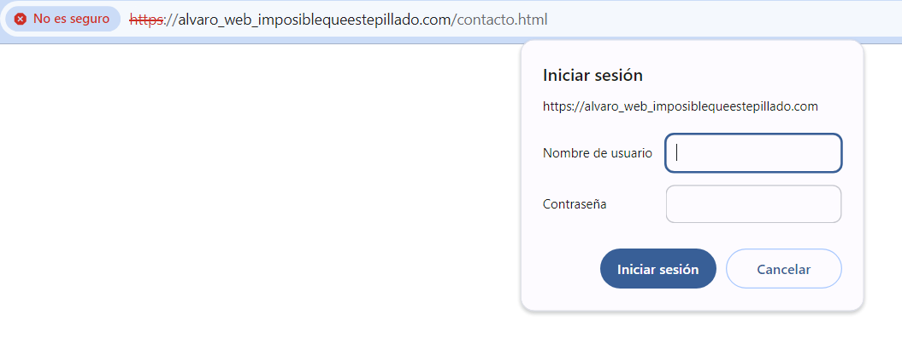

### Configura Nginx para que no deje acceder con la IP de la máquina anfitriona al directorio raíz de una de tus dos webs. Modifica su server block o archivo de configuración. Comprueba como se deniega el acceso:

Debemos añadir esto al location de `sites-available`:

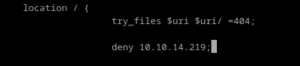

Y como se puede comprobar, nos denegará el acceso desde nuestra máquina anfitriona:

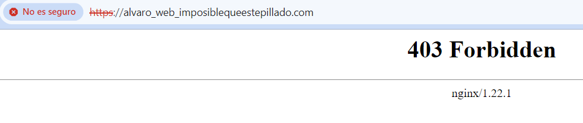

Esto es lo que se ve en el `error.log`.

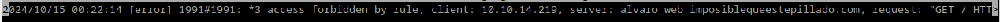

### Configura Nginx para que desde tu máquina anfitriona se tenga que tener tanto una IP válida como un usuario válido, ambas cosas a la vez, y comprueba que sí puede acceder sin problemas.

Añadimos esto al location de `sites-available`:

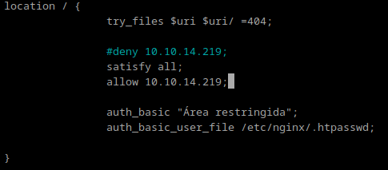

Y ahora nos permite el acceso:

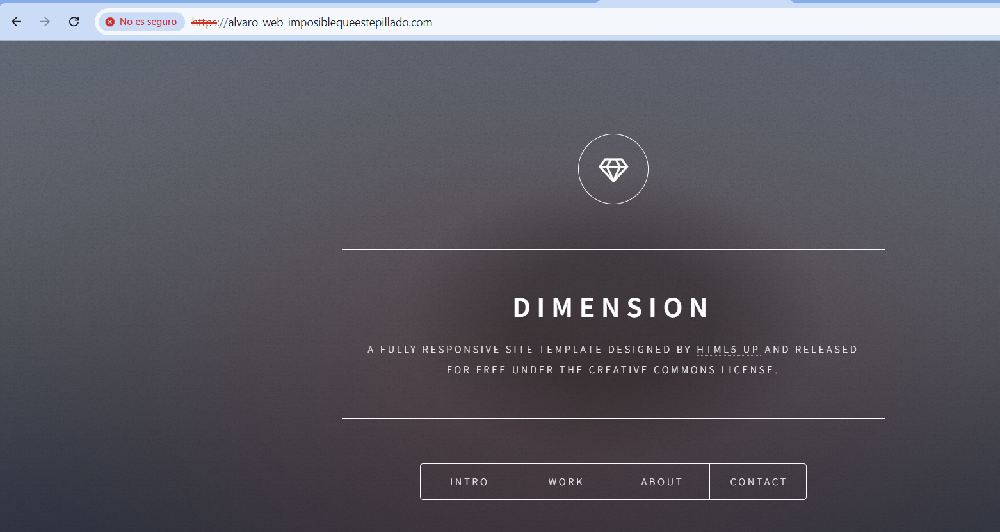
