# Practica 2.3
# Proxy inverso con Nginx

## Configuraciones

Primero tenemos que clonar nuestra máquina con el servidor Nginx y generar nuevas MACs:

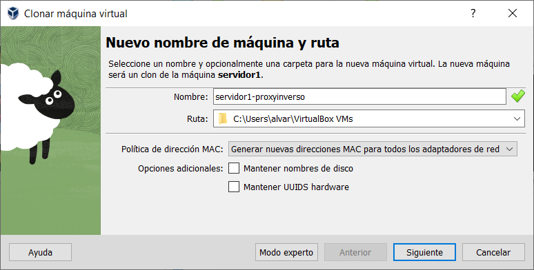

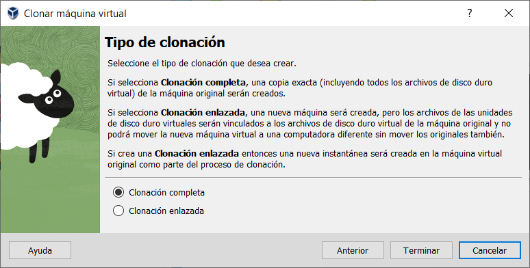

Una vez clonada, en la máquina del servidor cambiamos el nombre de nuestro dominio por webserver y que escuche por el puerto 8080.

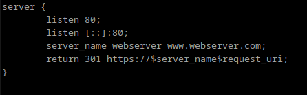

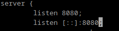

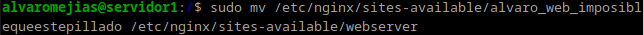

Y borramos el link simbólico:

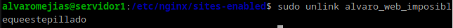

Y creamos el nuevo:

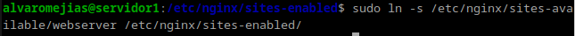

Reiniciamos Nginx:

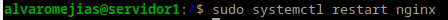

Y en la máquina proxy creamos un archivo de configuración que quede tal que así:

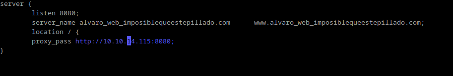

De nuevo, creamos el link simbólico:

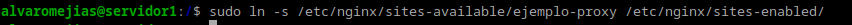

Y en nuestra máquina anfitriona agregamos al hosts lo siguiente:

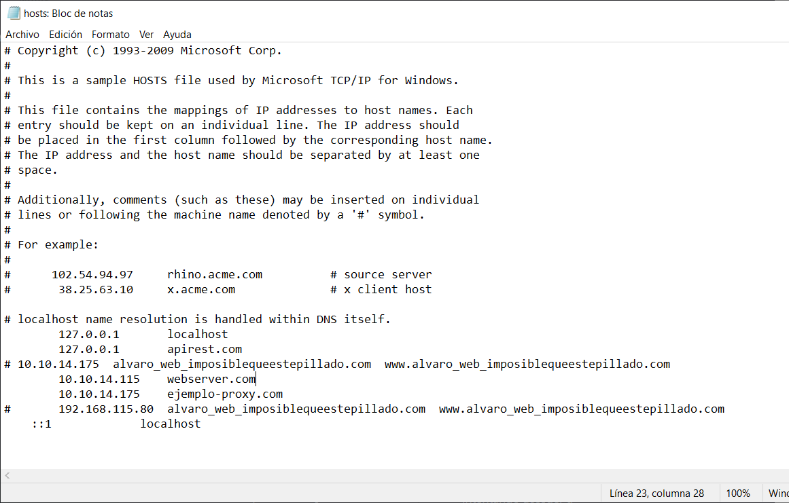

## Comprobaciones

Añadimos cabeceras tanto en el servidor como en el proxy:

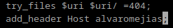

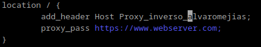

Y si utilizamos las herramientas de desarrollador de Google Chrome podemos comprobar que las cabeceras añadidas previamente se hallan ahí.

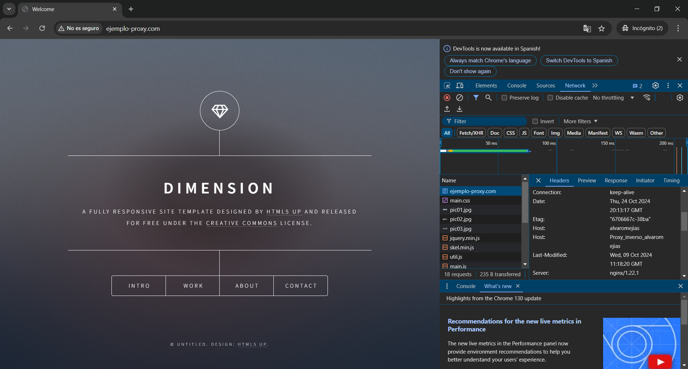
