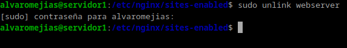
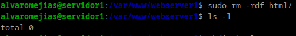
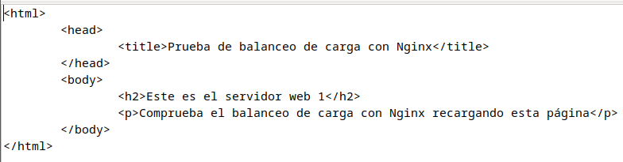
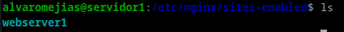
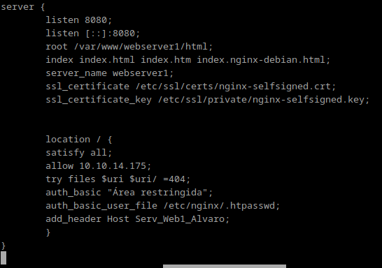
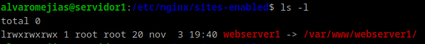
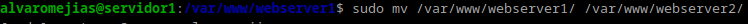
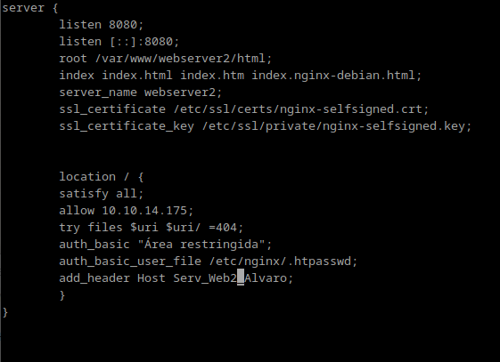
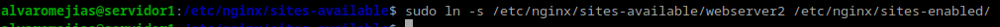
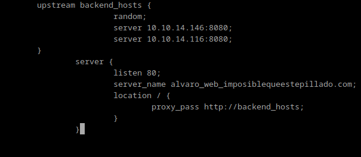

# Practica 2.4
# Balanceo de carga con proxy inverso en NGinx

## Configuraciones

Primero tenemos que clonar nuestra máquina y generar nuevas MACs:

### Servidor Nginx 1

Lo primero que deberemos hacer es cargarnos el enlace simbólico. Repetiremos el mismo proceso en la segunda máquina.

*Cambio de nombre*

Debemos cargarnos el sitio web con el que hemos estado trabajando hasta ahora y crear un index nuevo.

El index del webserver1:

Y creamos el nuevo enlace simbólico:

Y creamos el nuevo archivo de configuración:

### Servidor Nginx 2

Nos cargamos el enlace simbólico de la anterior máquina:

Renombramos de nuevo el sitio web...

Y repetimos el archivo de configuración, cambiando cualquier alusión a webserver1 por webserver2.

Y creamos el enlace simbólico.

### Proxy inverso

Finalmente, en sites-available, creamos un nuevo archivo de configuración:

### Cuestiones finales

1. Busca información de qué otros métodos de balanceo se pueden aplicar con Nginx y describe al menos 3 de ellos.

 - Round Robin:

Este es el método predeterminado en Nginx si no se especifica otro. Las solicitudes se distribuyen en turnos entre los servidores disponibles, sin tener en cuenta la carga actual ni la capacidad de cada servidor. Este método es simple y efectivo cuando los servidores tienen capacidades similares.

Configuración básica:
`upstream backend {
    server backend1.example.com;
    server backend2.example.com;
    server backend3.example.com;
}
`

 - Least Connections:

Con el método de "least connections" (menor número de conexiones), Nginx dirige cada solicitud al servidor con menos conexiones activas en ese momento. Esto ayuda a distribuir las cargas de manera más uniforme cuando algunos servidores están temporalmente más ocupados que otros.

Configuración básica:
`upstream backend {
    least_conn;
    server backend1.example.com;
    server backend2.example.com;
    server backend3.example.com;
}`

 - IP Hash:

En este método, Nginx asigna las solicitudes a un servidor específico en función de la dirección IP del cliente. Esto garantiza que un cliente con la misma IP siempre se conecte al mismo servidor, útil para mantener la sesión de usuario en aplicaciones que no son "stateless" o que requieren persistencia en el servidor.

Configuración básica:
`upstream backend {
    ip_hash;
    server backend1.example.com;
    server backend2.example.com;
}`

2. Si quiero añadir 2 servidores web más al balanceo de carga, describe detalladamente qué configuración habría que añadir y dónde.

Primero, debes ubicar la configuración del bloque upstream en el archivo de configuración de Nginx, que generalmente se encuentra en /etc/nginx/nginx.conf o en un archivo separado en el directorio /etc/nginx/conf.d/ (según cómo esté configurado tu servidor).

Dentro de este bloque, define los servidores existentes y agrega los nuevos servidores adicionales.

Asegúrate de que el bloque server correspondiente esté configurado para usar el bloque upstream. Esto suele estar en el archivo de configuración de tu host virtual, ubicado en /etc/nginx/sites-available/ o /etc/nginx/sites-enabled/, o también en /etc/nginx/nginx.conf si la configuración es global.

Finalmente, aplica los cambios recargando o reiniciando el servicio Nginx.