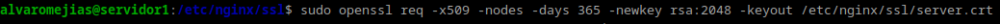
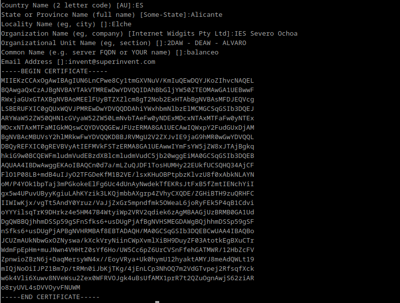
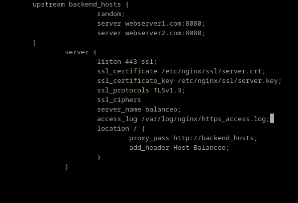
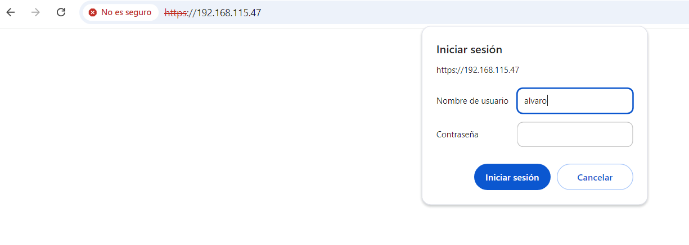
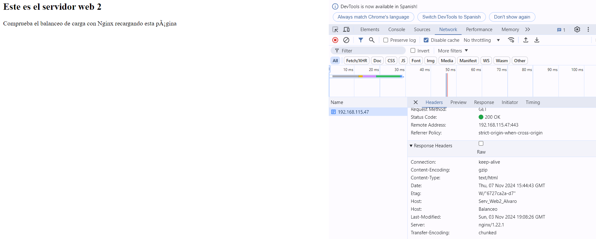
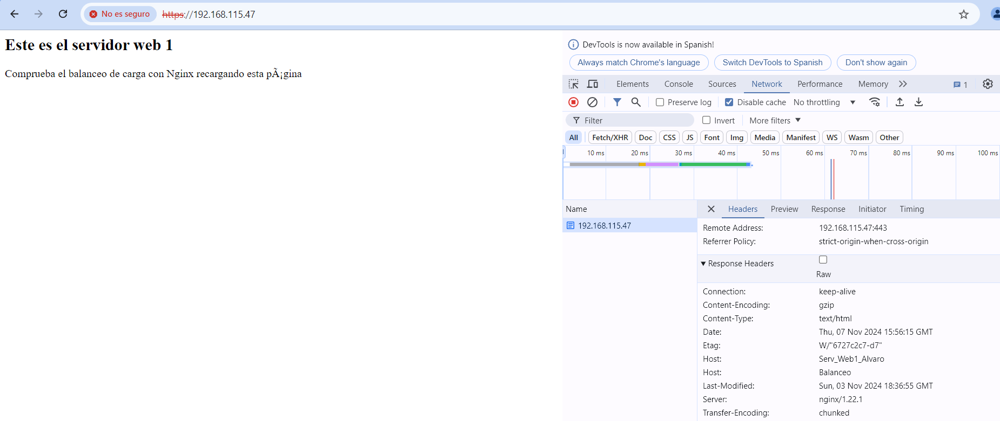
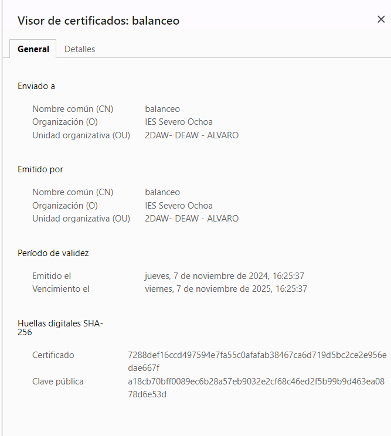

# Practica 2.5
# Proxy inverso y balanceo de carga con SSL en NGINX

Partiendo de la práctica anterior...

## Creación de certificado autofirmado

Lo primero que tenemos que hacer es crear el siguiente directorio:

Y utilizar el siguiente comando, con el que crearemos el certificado y las claves de forma simultánea:

*Nota:La práctica dice que se introduzcan exactamente los datos que aparecen en pantalla. Por asegurarme, así lo he hecho.*

*Cambio de nombre*

## Configuración SSL en el proxy inverso

En el archivo de configuración `/etc/nginx/sites-available/balanceo` debemos indicar que escuche por el puerto 443:

## Comprobaciones

Con nuestras otras dos máquinas encendidas, al intentar acceder desde nuestra máquina local a https:balanceo se nos pedirá autenticarnos:

Y si vemos el certificado, comprobamos que está todo en orden:

