# Practica 3.1
# Instalación de Tomcat y Maven para despliegue de aplicación en Java

## Instalación de Tomcat

Vamos a instalar Tomcat10 en nuestra máquina virtual con Debian 12.

Para empezar tenemos que descargar JDK, un software para los desarrolladores de Java que incluye el intérprete, las clases, y demás herramientas de desarrollo Java:

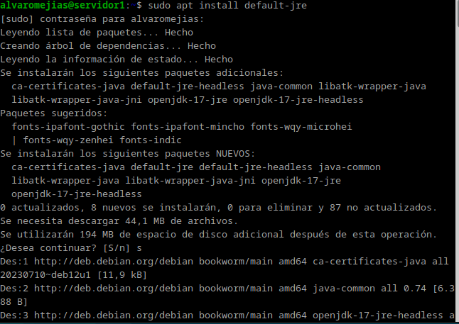

Adjunto una captura con la versión de Java instalada:

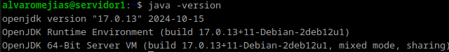

Ahora sí, podemos proceder con la instalación de Tomcat con el siguiente comando:

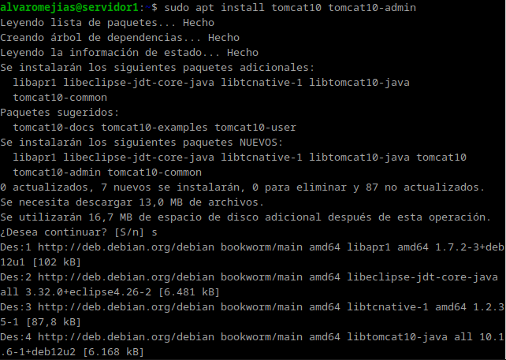

Ahora tenemos que crear nuestro usuario, así que accedemos al siguiente archivo y lo modificamos:

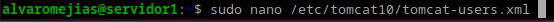

Debajo de los `<tomcat users>` introducimos nuestro usuario:

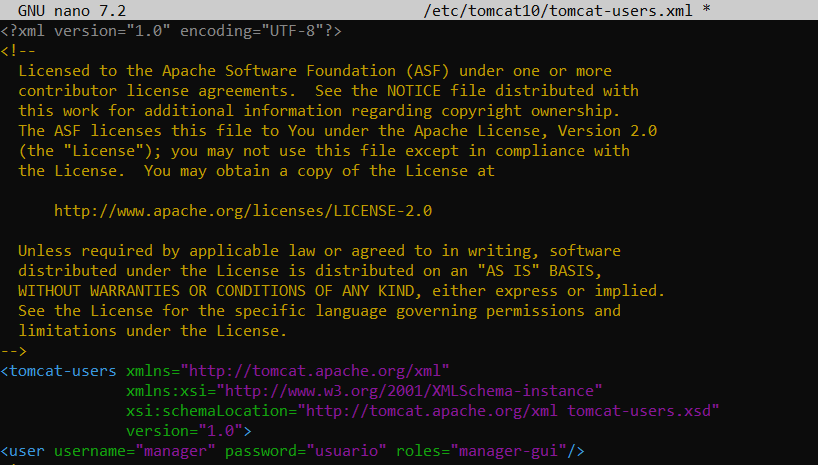

Tras esto tendremos que reiniciar el servicio y comprobar que funciona correctamente. Debe imprimirse algo como esto:

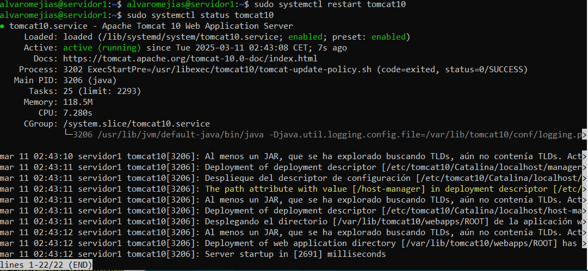

## Despliegue manual mediante la GUI de administración

Para comprobar que todo se despliega correctamente debemos acceder a `http://localhost:8080/nombre_usuario/html` y loguearnos con el nombre de usuario y la contraseña escogidas en el `tomcat-users.xml`.

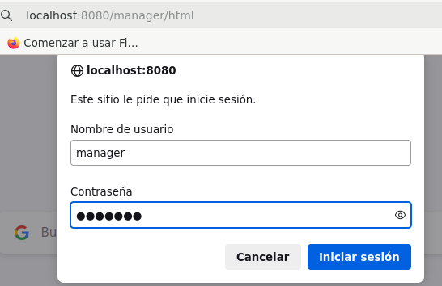

Y como podemos comprobar, de despliega adecuadamente.

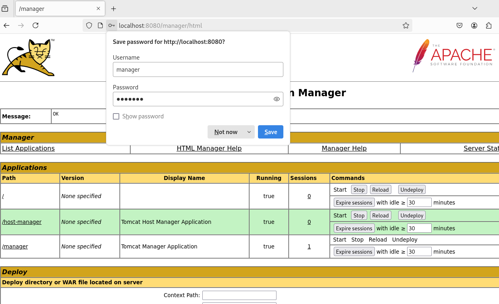

Ahora vamos a desplegar un archivo `.war`, en mi caso utilizaré el archivo de ejemplo de la dirección `https://tomcat.apache.org/tomcat-6.0-doc/appdev/sample/`, ya que el proporcionado en la práctica no funciona.

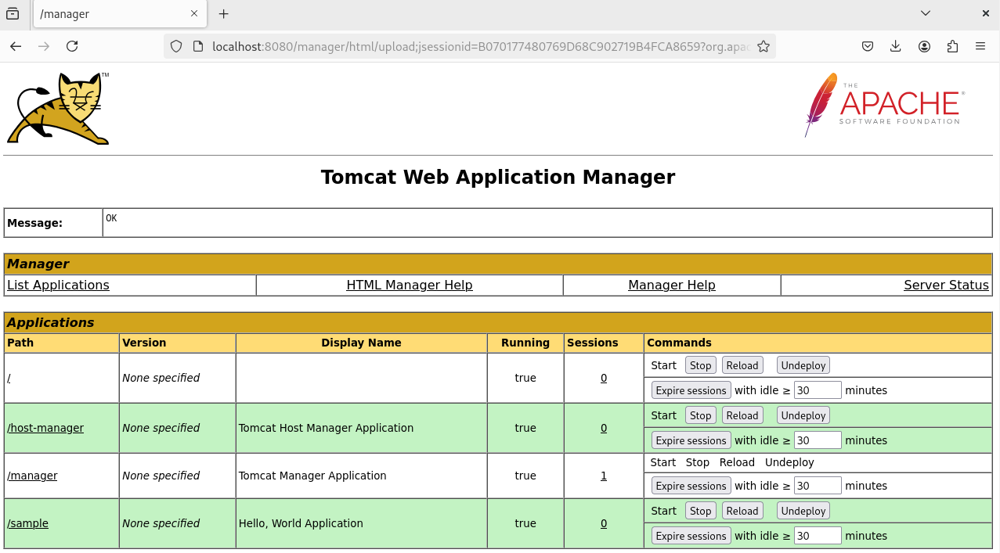

Como se aprecia en la captura, el archivo `/sample` se ha desplegado correctamente y si accedemos a él debería salir en pantalla lo siguiente (en caso de usar el `.war` indicado):

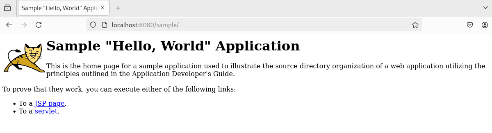

## Despliegue con Maven

### Instalación de Maven

Vamos a proceder a la instalación por medio del gestor de paquetes APT, pues es muy sencilla:

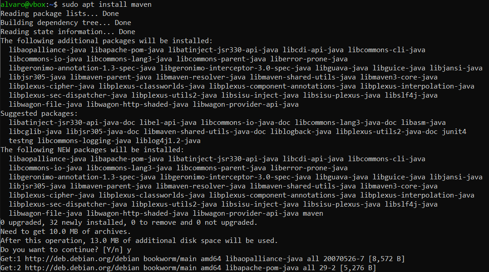

### Configuración de Maven

Debemos modificar el `tomcat-users.xml` y añadir otro usuario:

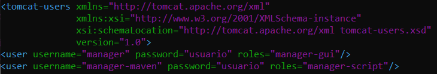

Y también el archivo `settings.xml`. Tendremos que encontrar en el archivo la etiqueta `<servers>` y crear ahí otra etiqueta `<server>` con el nombre del proyecto, usuario y contraseña:

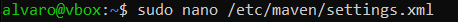
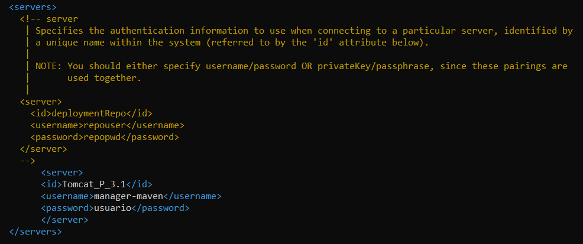

Vamos a utilizar un repositorio de ejemplo que se proporciona en la práctica:

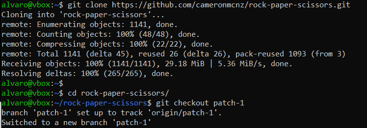

Buscamos el archivo `pom.xml`:

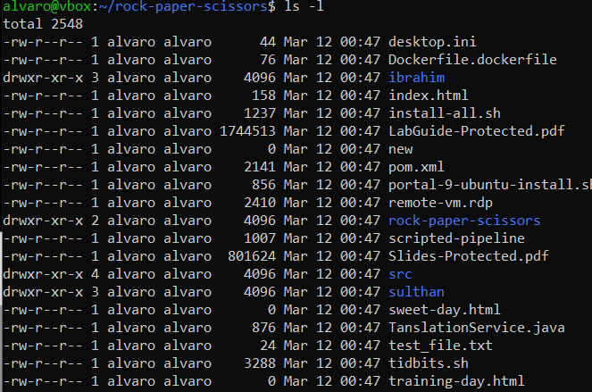

Y escribimos una etiqueta `<plugin>` con el nombre del server introducido en el archivo anterior, la url y el path.

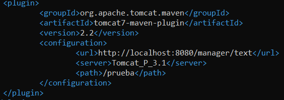

### Despliegue

Si todo ha ido bien, introducimos el siguiente comando para desplegar el proyecto:

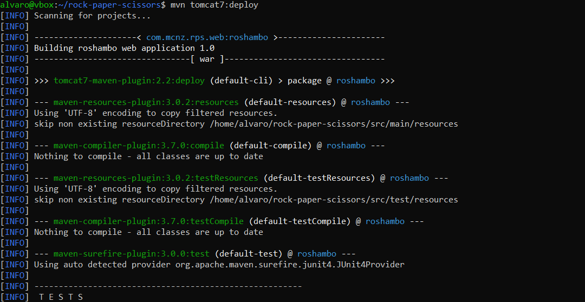

Y si en ``http://localhost:8080/nombre_usuario/html` se encuentra nuestro proyecto desplegado, accedemos a él y sale esto:

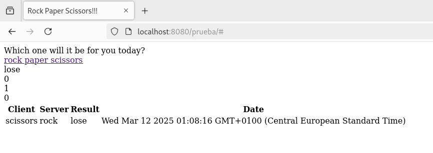

Felicidades, se ha desplegado con éxito.

# Cuestiones

>Habéis visto que los archivos de configuración que hemos tocado contienen contraseñas en texto plano, por lo que cualquiera con acceso a ellos obtendría las credenciales de nuestras herramientas. En principio esto representa un gran riesgo de seguridad, ¿sabrías razonar o averigüar por qué esto está diseñado de esta forma?

Por la simplicidad de configuración y suponiendo que Tomcat se usará en entornos controlados y seguros, pero en producción, es recomendable evitar esta práctica y hacer uso de una autenticación externa.