# Practica 3.2
# Despliegue de aplicaciones con Node Express y en Netlify

## Node Express

Lo primero que tendremos que hacer será actualizar el sistema operativo:

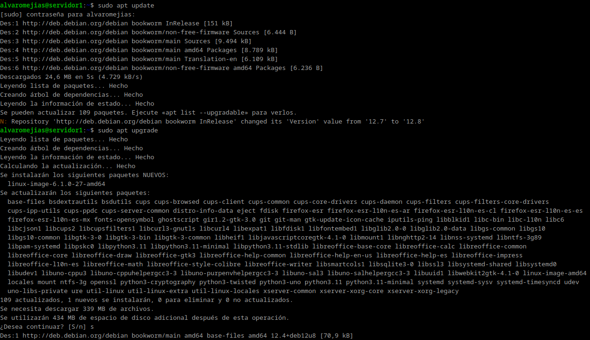

También necesitaremos el paquete curl

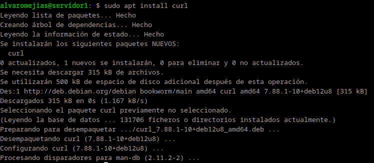

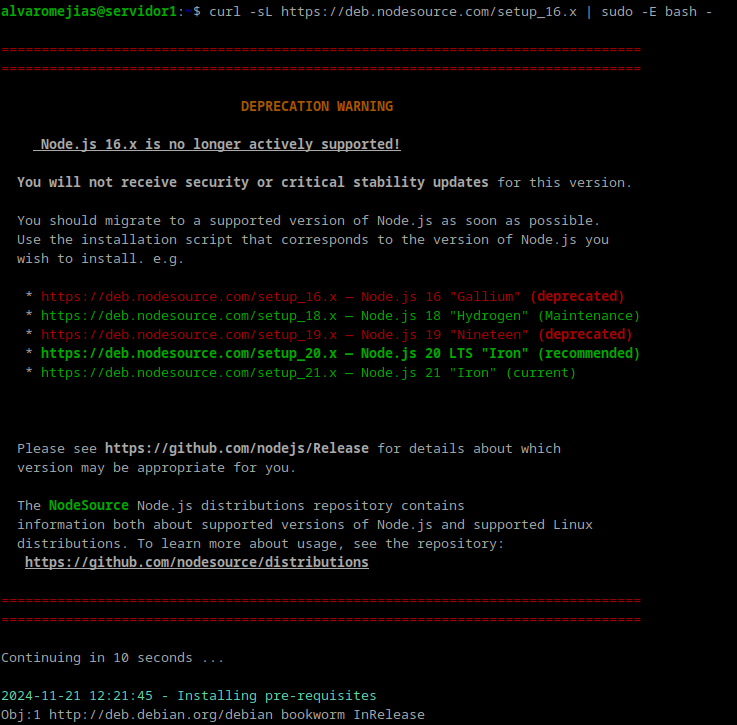

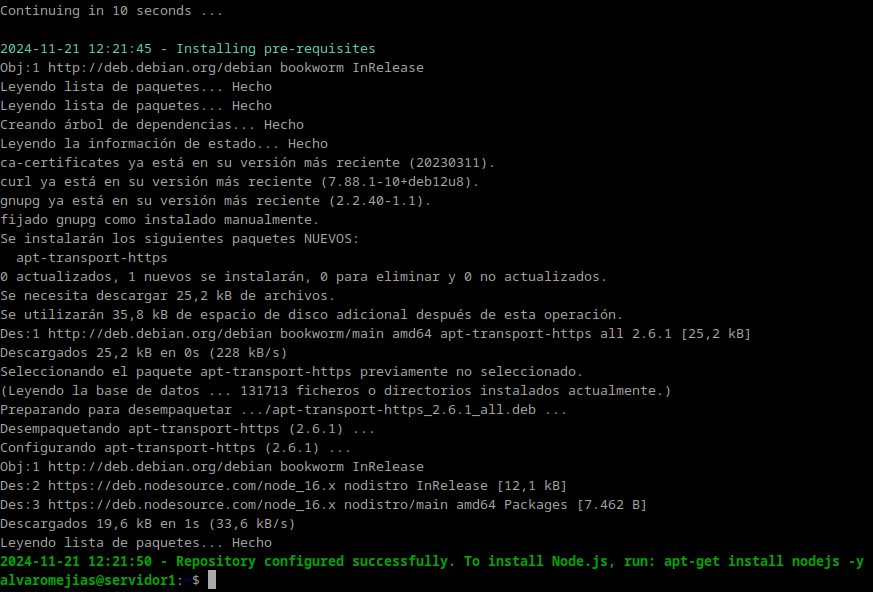

Una vez hecho esto, podemos instalar nodejs:

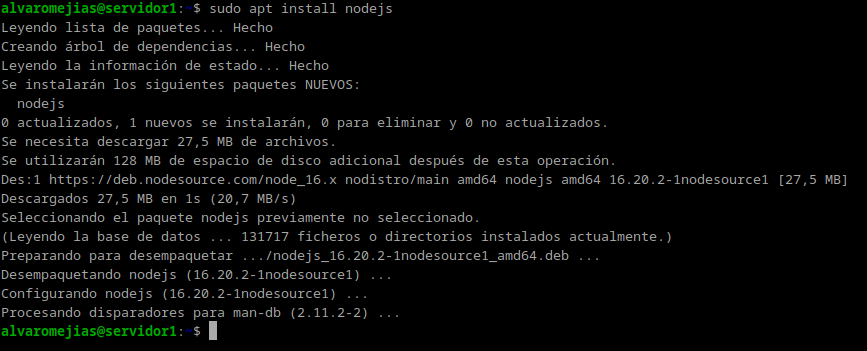

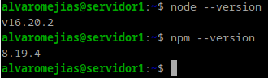

*versiones de node y npm*

Ahora instalamos Express.js:

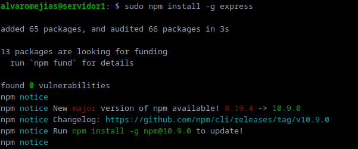

Nos creamos un directorio sobre el que clonar el repositorio indicado en la guía.

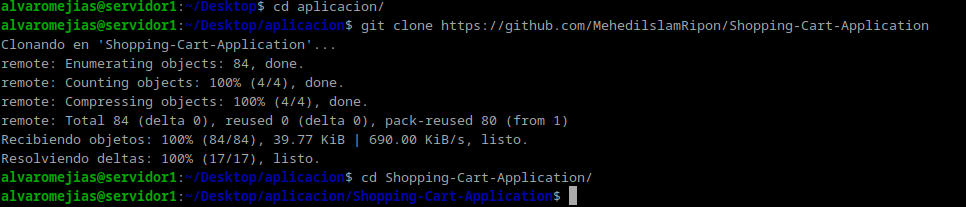

Y ejecutamos `npm install` para instalar las librerías y `npm run start` para iniciar la aplicación:

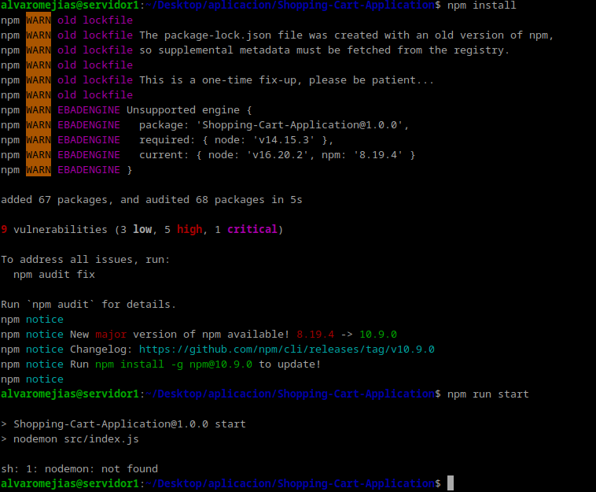

Tal y como indica la guía, nos encontramos con el error `sh: 1: nodemon: not found`.

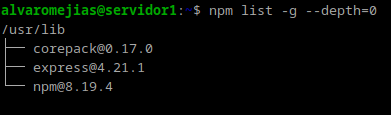

El error es simple, no tenemos nodemon instalado (como se puede ver en la lista), por lo que tenemos que instalarlo:

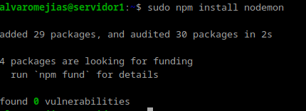

*instalación global*

Al haberlo instalado globalmente tengo que comprobar en la variable `PATH` está incluido algo así como: `/usr/local/bin
`

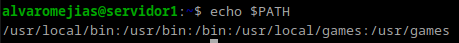

Como se puede apreciar en la captura, se ha instalado correctamente.

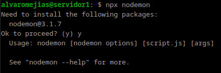

Por si hubiera problemas, ejecuto también este comando, que ejecuta paquetes instalados localmente sin necesidad de agregarlos al PATH.

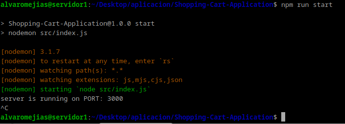

Y como se puede apreciar, la aplicación se ha iniciado sin problemas.

## Netlify

Primeramente, creamos un directorio con 2 `.html` y un `.js`:

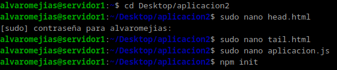

Y, tras comprobar que la aplicación funciona correctamente mediante un `node aplicacion.js`:

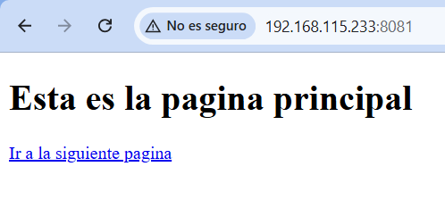

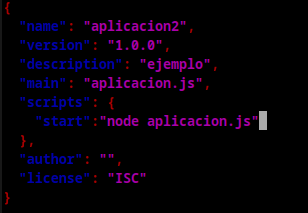

*Nota : En el bloque scripts, debemos borrar lo que haya dentro y dejar únicamente dentro de él: "start": "node aplicacion.js", de forma que el sitio donde la despleguemos sepa que comando utilizar para iniciar la aplicación tras desplegarla.*

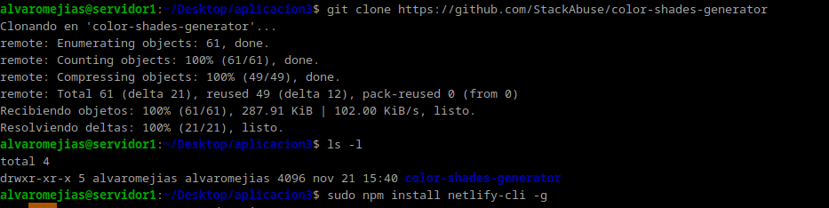

Clonamos el repositorio indicado en la guía e instalamos el CLI de Netlify.

Tras habernos registrado en Netlify, establecemos el token de autentificación como variable de entorno y nos logueamos:

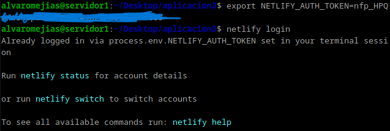

Instalamos las dependencias y realizamos el build:

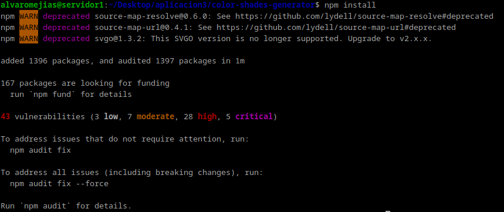

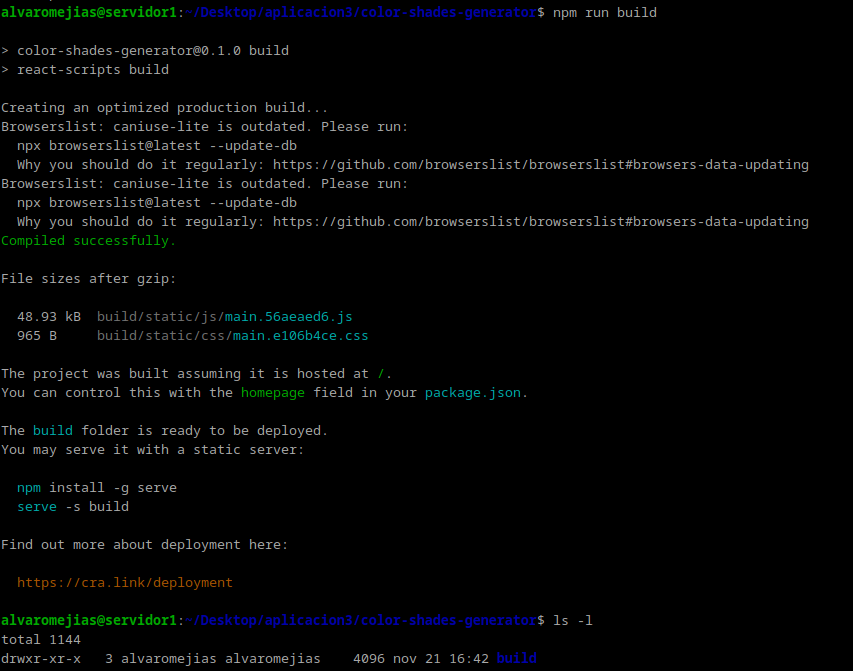

Y hacemos el deploy:

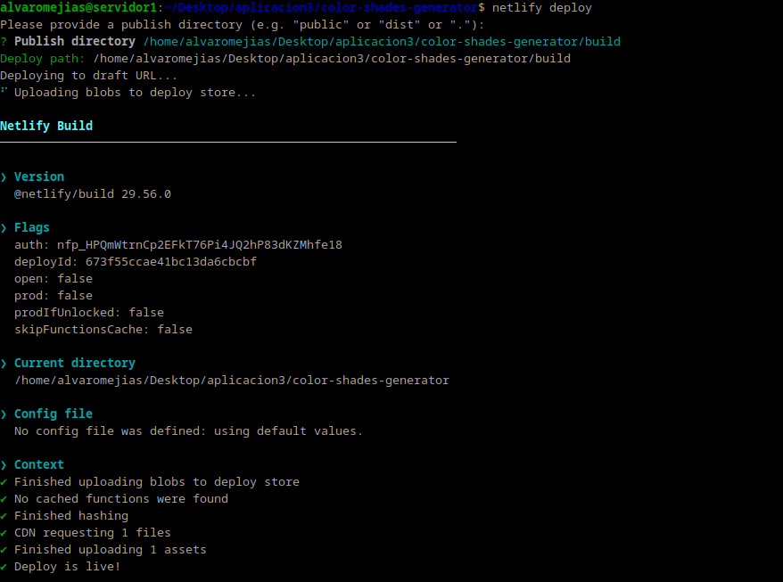

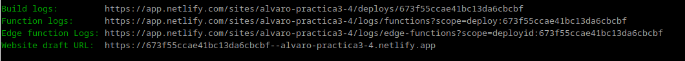

Accedemos a esa url y:

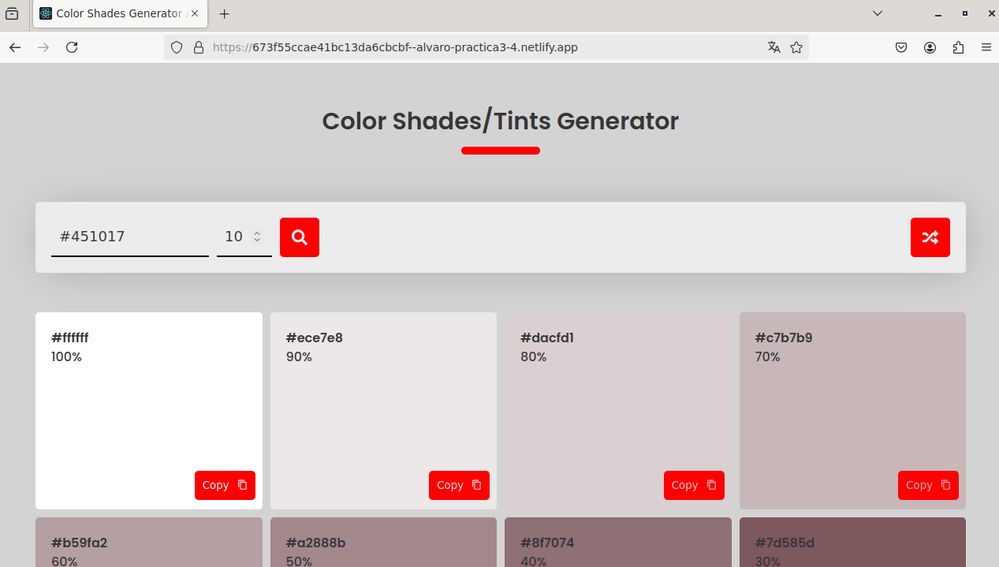

¡Aplicación lanzada con éxito!

Para realizar el despliegue mediante GitHub, primero debemos eliminar el sitio:

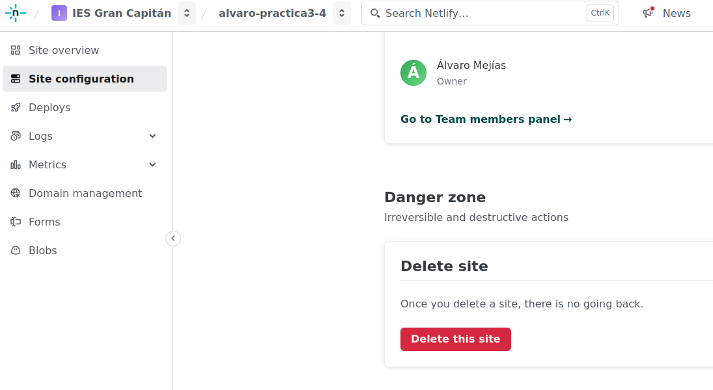

Eliminamos también el directorio:

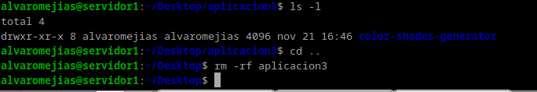

Y nos descargamos el siguiente archivo comprimido sin referencias a Github:

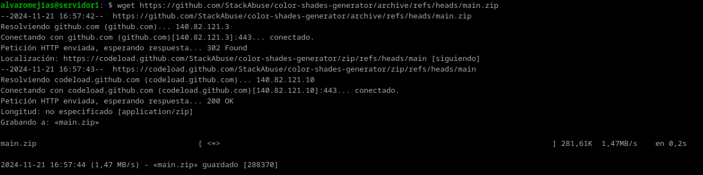

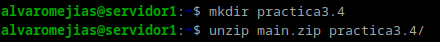

Seguimos los siguientes pasos:

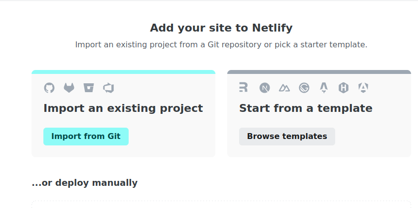

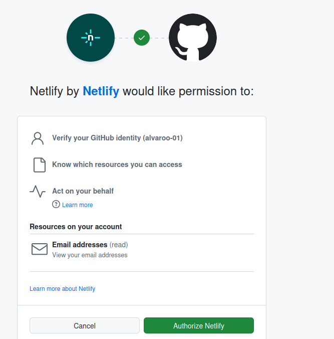

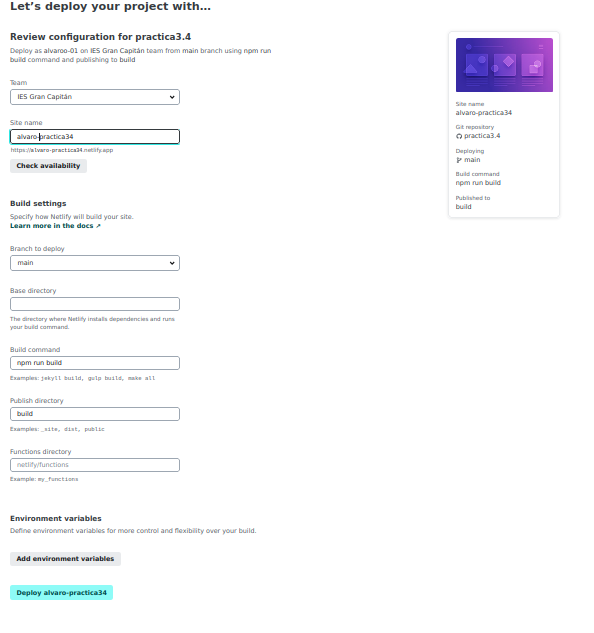

En el archivo `robots.txt` escribimos eso:

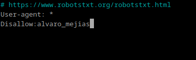

Y como podemos comprobar se ha desplegado correctamente:

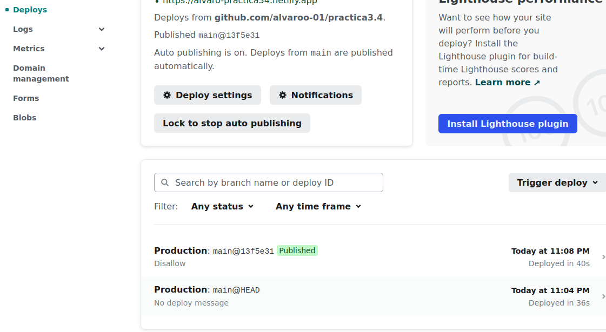

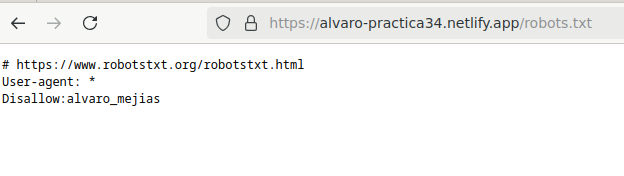

# Fin de la práctica