# Practica 3.3
# Despliegue de una aplicación Flask (Python)

## Procedimiento completo para el despliegue

Lo primero que tenemos que hacer es instalar el gestor de paquetes de Python `pip`:

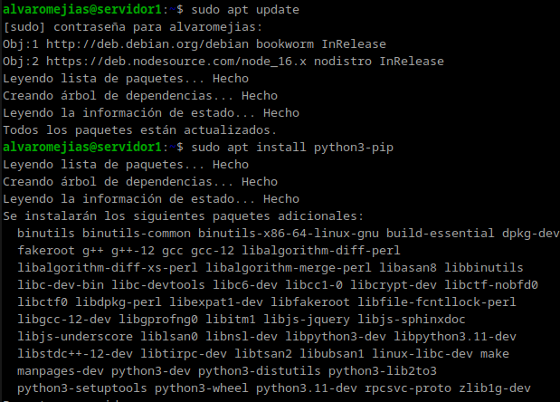
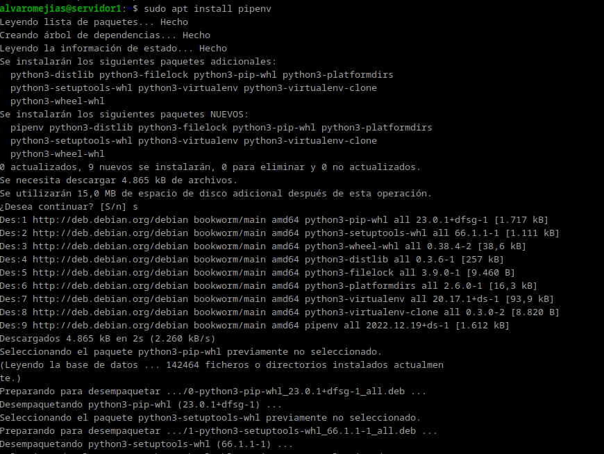
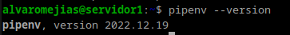

Creamos un directorio donde almacenaremos la aplicación y le establecemos los permisos necesarios:

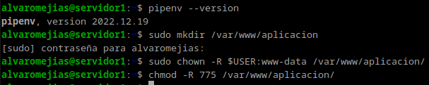
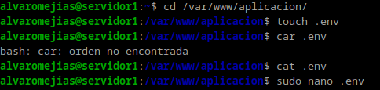

Creamos un archivo oculto con las variables de entorno necesarias:

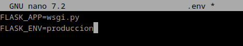

E iniciamos el entorno virtual:

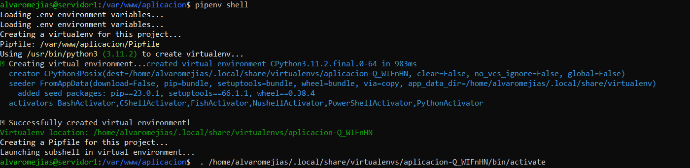

Instalamos las dependencias necesarias para este proyecto en concreto:

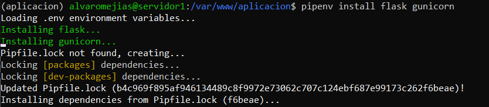

Creamos los siguientes archivo, de manera que se vea tal que así:

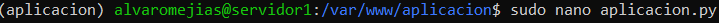
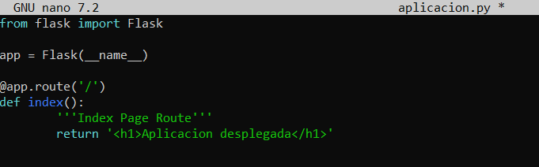
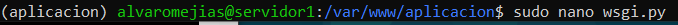
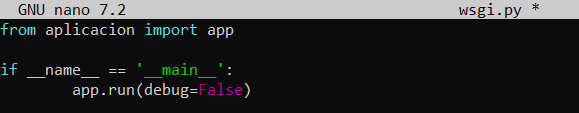

Y corremos nuestra aplicación:

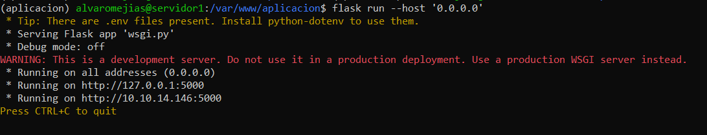

Debemos comprobar que funciona accediendo a nuestra dirección IP en el navegador.

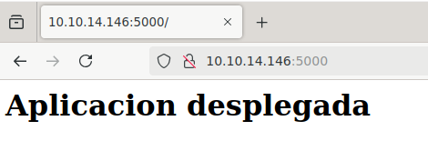

Y como se puede apreciar, la aplicación se ha iniciado sin problemas.

Para parar el servidor pulsamos CTRL + C.

Ahora bien, para comprobar que Gunicorn funciona correctamente introducimos el siguiente comando:

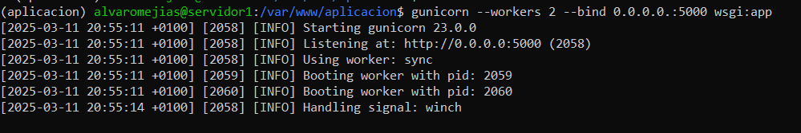

Y tomamos nota de la ruta desde la que se ejecuta.

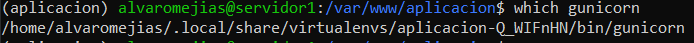

Para salir del entorno virtual tenemos que introducir `deactivate`:

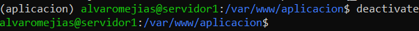

Tras esto, tenemos que asegurarnos que Nginx está funcionando.

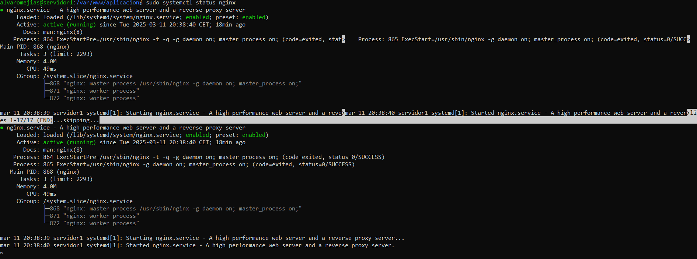

Y crear un archivo para que `systemd` corra Gunicorn:

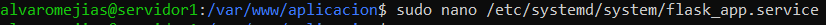

Ahora habilitamos e iniciamos el servicio:

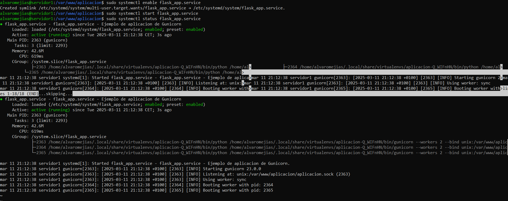

Para el siguiente paso tendremos que configurar Nginx. Editamos el archivo de la aplicación en `sites-available` de manera que se vea así:

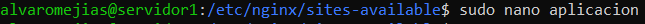
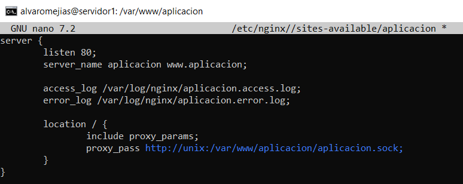

Y creamos nuestro enlace simbólico:

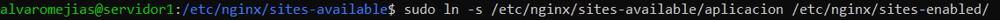
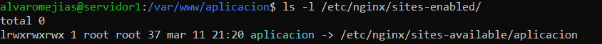

Tras esto, nos aseguramos de que hemos configurado Nginx correctamente y reiniciamos el servicio:

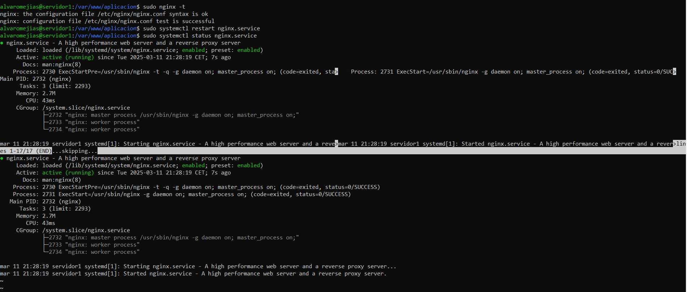

Modificaremos el archivo `/etc/hosts`:

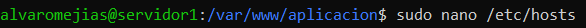
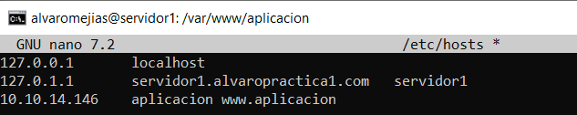

Como hemos realizado todos los pasos correctamente, al comprobar si la aplicación se ha desplegado de manera exitosa veremos que, en efecto, así es:

## Realizar el mismo procedimiento con la aplicación clonada del repositorio

Ahora tenemos que realizar todo este proceso pero con la aplicación que se nos proporciona en el GitHub de la guía, por lo que clonamos el repositorio y procedemos a hacer lo mismo:

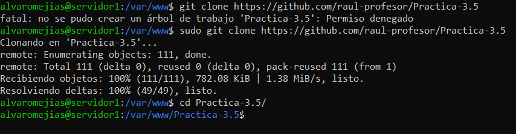

1. Creamos el archivo oculto:

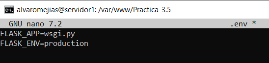

2. Otorgamos los permisos necesarios:

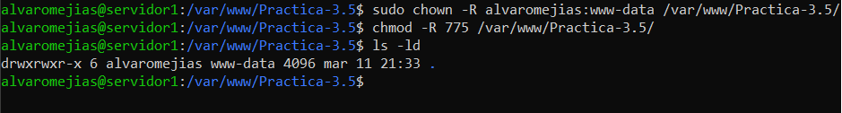

3. Iniciamos el entorno virtual:

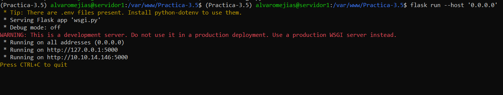

4. Comprobamos que la aplicación se despliega correctamente:

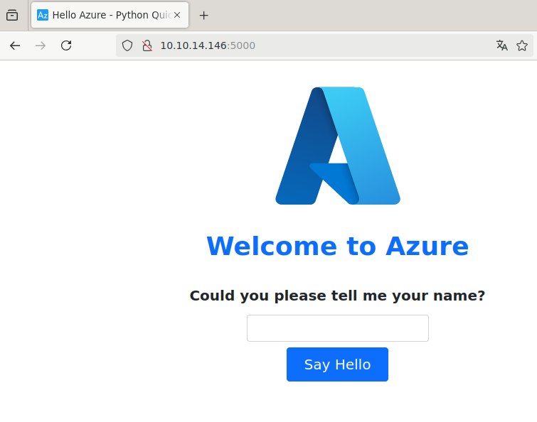

5. Comprobamos que Gunicorn funciona correctamente:

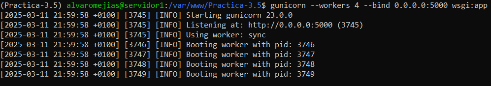

6. Tomamos nota de la ruta:

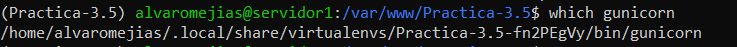

7. Creamos el archivo para `systemd`:

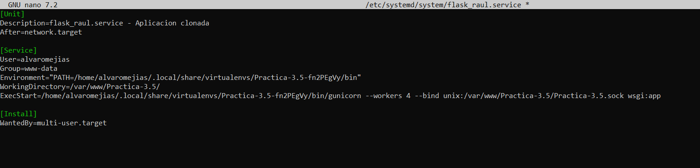

8. Modificamos la configuración de Nginx:

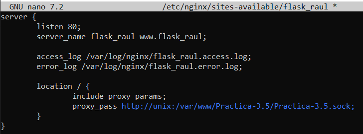

9. Habilitamos el servicio:

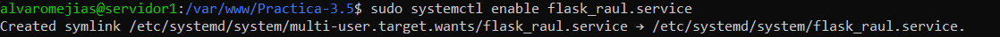

10. Y para terminar, creamos el enlace simbólico y modificamos `/etc/hosts`:

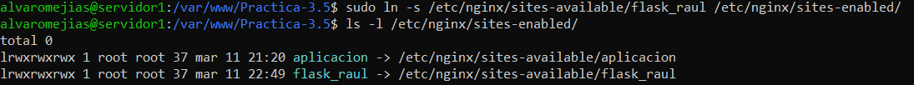
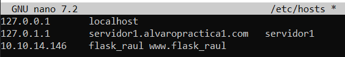

# Cuestiones

>Busca, lee, entiende y explica qué es y para que sirve un servidor WSGI

Un servidor WSGI (Web Server Gateway Interface) actúa como intermediario entre aplicaciones web escritas en Python y servidores web como Apache o Nginx, traduciendo solicitudes HTTP en datos procesables por Python y devolviendo respuestas al cliente. Permite compatibilidad entre frameworks, facilita el despliegue en producción y mejora el manejo de múltiples solicitudes concurrentes de manera eficiente