# Practica 4.1
# Instalación de un servidor DNS

Tenemos que escribir el siguiente comando:

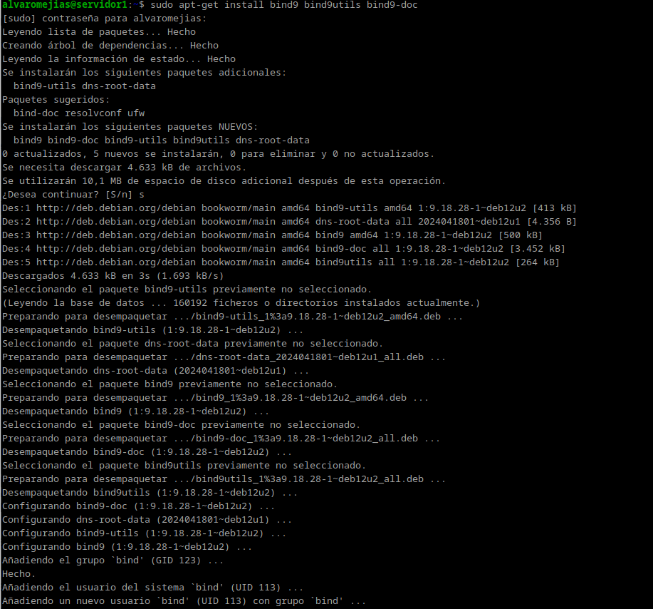

## Configuración del servidor

Tendremos que modificar el archivo ```/etc/default/named```

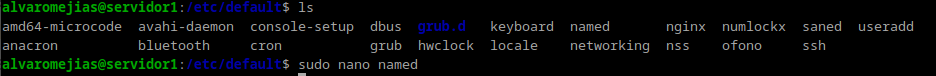

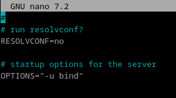

En ```OPTIONS=``` escribimos lo siguiente:

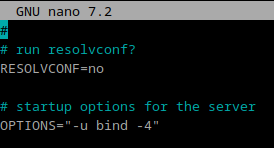

Una vez hecho esto, podemos instalar nodejs:

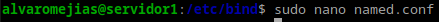

Aquí podemos encontrar los 3 archivos que vamos a modificar a lo largo de la práctica.

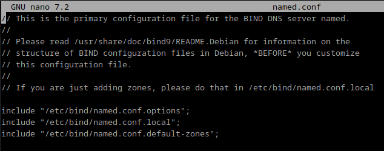

Realizamos una copia del archivo ```named.conf.options```:

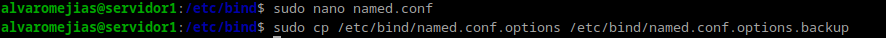

Y ya podemos modificar el archivo sin miedo.

Antes de options escribimos lo siguiente, rellenándolo con nuestra ip propia.

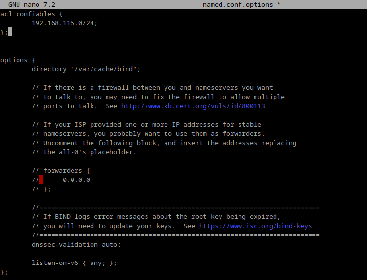

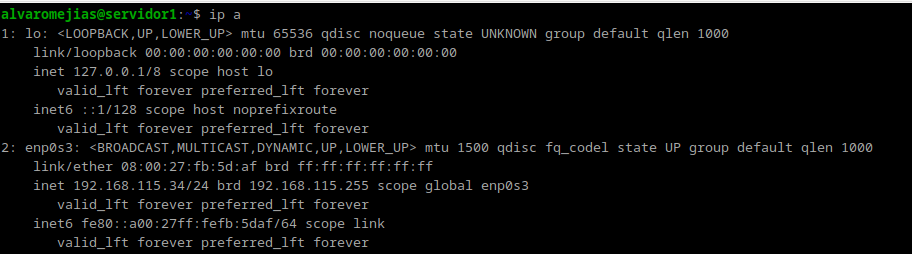
*Nota: esa es mi IP*

Y tras forwarded ponemos las siguientes opciones:

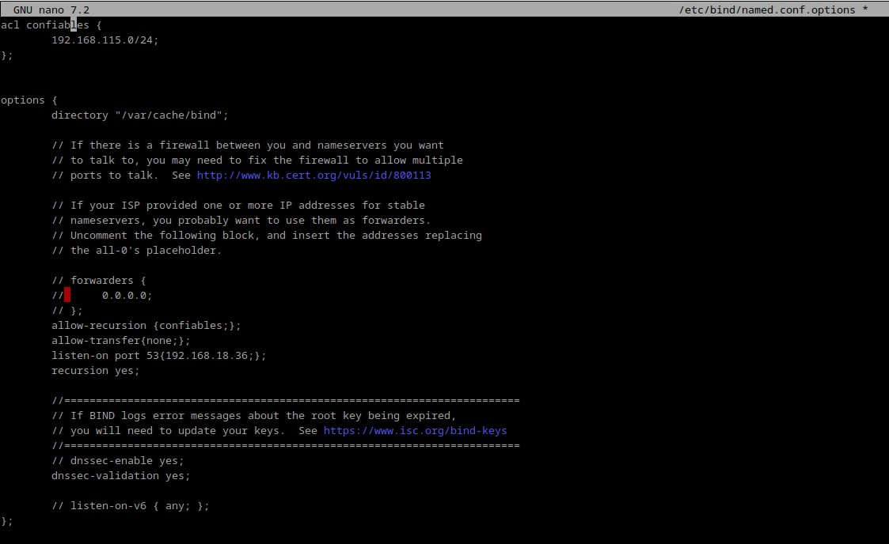

Podemos comprobar que hasta ahora todo funciona correctamente con el siguiente comando:

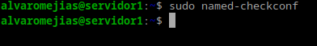

Y ahora reiniciamos el servicio y comprobamos el estado:

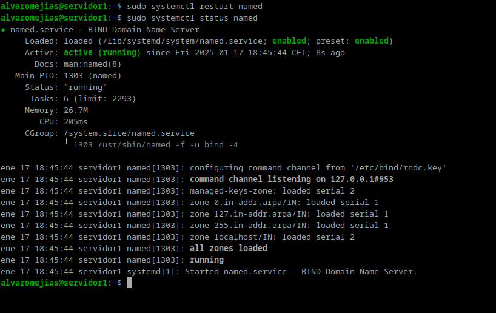

Ahora debemos modificar el archivo ```/etc/bind/named.conf.local```

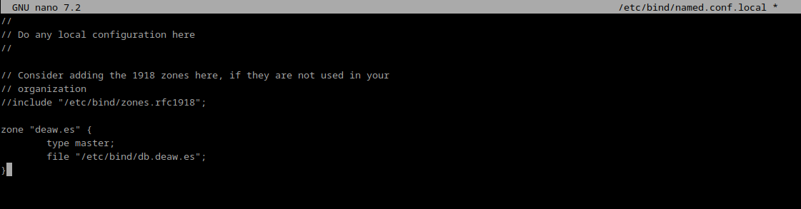

## Creación del archivo de zona (resolución directa e inversa)

En la captura se muestra como se crea la zona, ahora sólo necesitamos el archivo de zona.

El nombre del archivo será ```db.deaw.es```, que es el nombre que le hemos dado a la zona en ```/etc/bind/named.conf.local```.

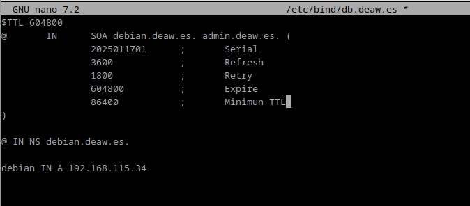
*Nota: se le puede dar cualquier valor numérico al serial, aunque se recomienda usar el año, mes, día y versión*.

Debemos crear un archivo de zona para la resolución inversa, pero antes creamos la zona en ```/etc/bind/named.conf.local```.

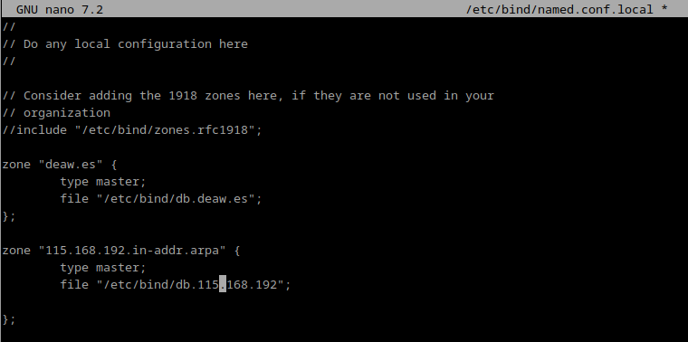

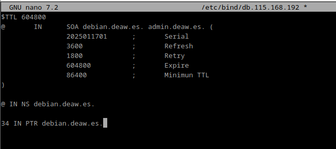
*en mi caso lo llamaré ```db.115.168.192``` porque es mi dirección IP inversa sin contar el último byte.*

## Comprobación de las configuraciones

Comprobamos que tanto la resolución directa e inversa se han configurado correctamente con el siguiente comando:

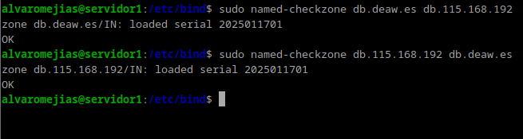

Y reiniciamos el servicio de nuevo:

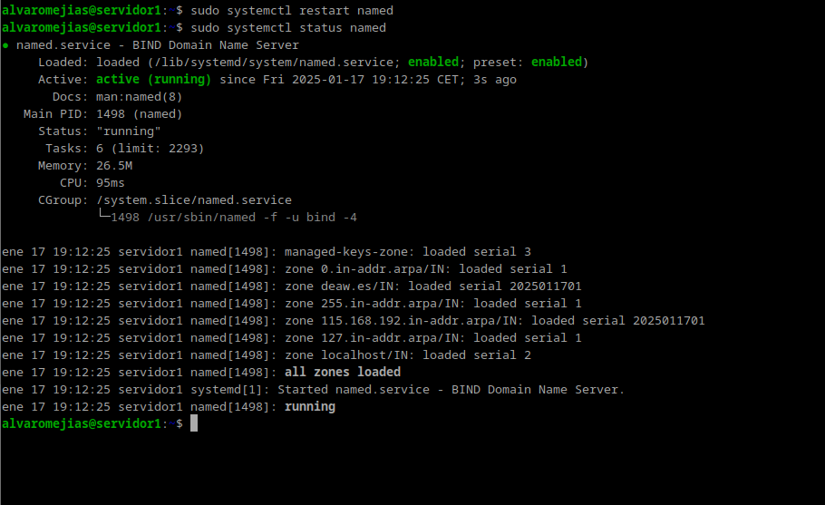

Abrimos otra máquina virtual a modo de cliente (o lo hacemos desde nuestra propia máquina) y creamos el siguiente archivo de configuración:

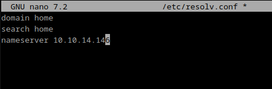
*Nota: En nameserver ponemos nuestra dirección IP correspondiente*

Introducimos los siguientes comandos:

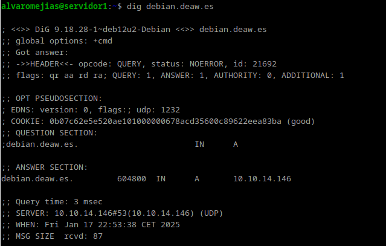


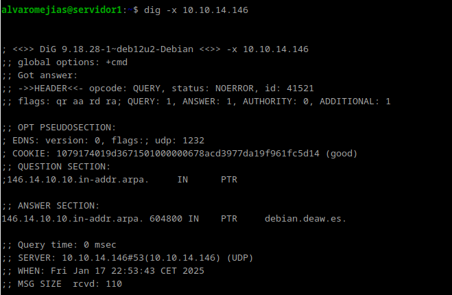

Como se puede comprobar, funciona todo correctamente.

## Cuestiones Finales

### Cuestión 1
**¿Qué pasará si un cliente de una red diferente a la tuya intenta hacer uso de tu DNS de alguna manera, le funcionará?¿Por qué, en qué parte de la configuración puede verse?**

No funcionará, ya que en la configuración se ha indicado: ```allow-recursion{confiables;};```

### Cuestión 2
**¿Por qué tenemos que permitir las consultas recursivas en la configuración?**

Porque sin recursión no resolvería nombres externos.

### Cuestión 3
**El servidor DNS que acabáis de montar, ¿es autoritativo?¿Por qué?**

Sí, se ha introducido ```type master;``` y recibe registros DNS de una sola zona específica.

### Cuestión 4
**¿Dónde podemos encontrar la directiva $ORIGIN y para qué sirve?**

En los archivos de zona. Establece el dominio base para los registros.

### Cuestión 5
**¿Una zona es idéntico a un dominio?**

No, un dominio es un nombre dentro del sistema DNS. Una zona es una parte de un dominio gestionada por un servidor DNS específico.

### Cuestión 6
**¿Pueden editarse los archivos de zona de un servidor esclavo/secundario?**

No, los servidores secundarios obtienen los datos de un servidor maestro mediante transferencias de zona.

### Cuestión 7
**¿Por qué podría querer tener más de un servidor esclavo para una misma zona?**

Para mejorar la redundancia y la disponibilidad. Si un servidor secundario falla, los otros servidores secundarios pueden seguir respondiendo a las consultas.

### Cuestión 8
**¿Cuántos servidores raíz existen?**

Existen 13 servidores raíz.

### Cuestión 9
**¿Qué es una consulta iterativa de referencia?**

Una consulta en la que un servidor DNS responde con la mejor información que tiene.

### Cuestión 10
**En una resolución inversa, ¿a qué nombre se mapearía la dirección IP 172.16.34.56?**

56 IN PTR + [nombre_host].