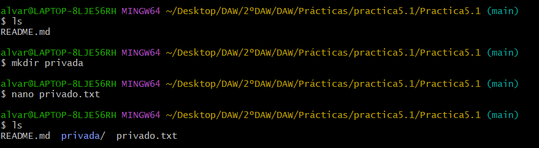

# Practica 5.1
# Ejercicios Git y GitHub 1

## Repositorio DEAW:

1. Crear un repositorio en vuestro GitHub llamado DEAW.
2. Clonar vuestro repositorio en local.

## README

1. Crear (si no lo habéis creado ya) en vuestro repositorio local un documento README.md.

Como se puede observar en las capturas anteriores, cree el README.md al crear el repositorio.

## Commit inicial

1. Realizar un commit inicial con el comentario: Comenzamos con los ejercicios de Git

## Push inicial

1. Subir los cambios al repositorio remoto.

## Ignorar archivos

1. Crear en el repositorio local un fichero llamado privado.txt.

2. Crear en el repositorio local una carpeta llamada privada.

3. Realizar los cambios oportunos para que tanto el archivo como la carpeta sean ignorados por git.

## Añadir fichero 1.txt

1. Añadir fichero 1.txt al repositorio local.

## Crear el tag v0.1

1. Crear un tag v0.1.

## Subir el tag v0.1

1. Subir los cambios al repositorio remoto.

Como se puede observar en la captura anterior, ya he añadido y subido el tag.

## Cuenta de GitHub

1. Poner una foto en vuestro perfil de GitHub.

2. Poner el doble factor de autentificación en vuestra cuenta de GitHub.

## Uso social de GitHub

1. Preguntar los nombres de usuario de GitHub de 2 de tus compañeros de clase, búscalos, y sigueles.

2. Seguir los repositorios DEAW del resto de tus compañeros.

3. Añadir una estrella a los repositorios DEAW del resto de tus compañeros.

## Crear una tabla

1. Crear una tabla de este estilo en el fichero README.md con la información de varios de tus compañeros de clase.

La tabla se realizaría de esta manera:

## Colaboradores

1. Poner a un compañero de clase como colaborador del repositorio DEAW.

## Crear una rama v0.2

1. Crear una rama v0.2.

2. Posiciona tu carpeta de trabajo en esta rama.

## Añadir fichero 2.txt

1. Añadir un fichero 2.txt en la rama v0.2.

## Crear una rama remota v0.2

1. Subir los cambios al repositorio remoto.

## Merge directo

1. Posicionarse en la rama master.

2. Hacer un merge de la rama v0.2 en la rama master.

## Merge con conflicto

1. En la rama master poner Hola en el fichero 1.txt y hacer commit.

2. Posicionarse en la rama v0.2 y poner Adios en el fichero "1.txt" y hacer commit.

3. Posicionarse de nuevo en la rama master y hacer un merge con la rama v0.2

## Listado de ramas

1. Listar las ramas con merge y las ramas sin merge.

## Arreglar conflicto

1. Arreglar el conflicto anterior y hacer un commit.

## Listado de cambios

1. Crear un tag v0.2

2. Borrar la rama v0.2

