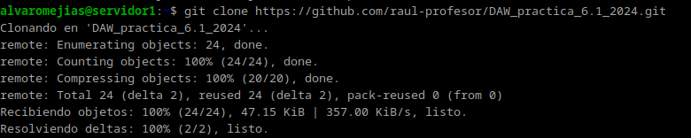

# Practica 6.1
# Dockerización del Despliegue de una Aplicación con Node.js

## Despliegue con Docker

Para esta práctica tendremos que instalar Docker, pero antes clonaremos el repositorio de Github del autor de los apuntes.

Actualizamos e instalamos:

Ahora sí, podemos modificar el archivo `Dockerfile`. En un inicio, se ve tal que así:

Tendremos que rellenar los espacios con las siguientes opciones:

- RUN crea el directorio en el contenedor
- WORKDIR establece el directorio como directorio de trabajo
- COPY copia los ficheros `package.json` y `packa-lock.json` desde `src` al directorio de trabajo definido en WORKDIR
- Tras esto, se instalan las dependencias
- Se copia el resto de `src` al contenedor
- EXPOSE expone el puerto 3000 para acceder desde fuera del contenedor
- CMD indica el comando que se ejecutará al iniciar el contenedor.

Ejecutamos el comando siguiente para construir la imagen

Indicamos que escuche las peticiones en el puerto 3000:

Y en caso de probar, la aplicación intentará conectarse a la base de datos que todavía no está configurada en el debido contenedor.

## Docker Compose

Instalamos Docker Compose.

*Nota: versión actual indicada*

Y verificamos que el archivo `docker-compose.yml` existe y tiene el contenido correcto:

Debemos crear la estructura de la base de datos (tablas, etc.):

Y levantar los contenedores:

Introducimos el siguiente comando para testear:

## Tarea

*Probad que la aplicación junto con la BBDD funciona correctamente. El funcionamiento de la API es:*
*GET /persons/all muestra todas las personas en el libro de direcciones*
*GET /persons/1 muestra la persona con el id 1*
*PUT /persons/ añade una persona al libro de direcciones*
*DELETE /persons/1 elimina a la persona con el id 1*

*Ejemplos:*

 *curl -X PUT http://IP_APLICACION:3000/persons -H 'Content-Type: application/json' -d '{"id": 1, "firstName": "Raúl", "lastName": "Profesor"}'*

 *curl -X GET http://localhost:3000/persons -H 'Content-Type: application/json'*

