# Practica 6.2
# Despliegue de una aplicación PHP con Nginx y MySQL usando Docker y docker-compose

## Estructura de directorios

Según el guión de la práctica necesitamos tener la siguiente estructura de archivos:

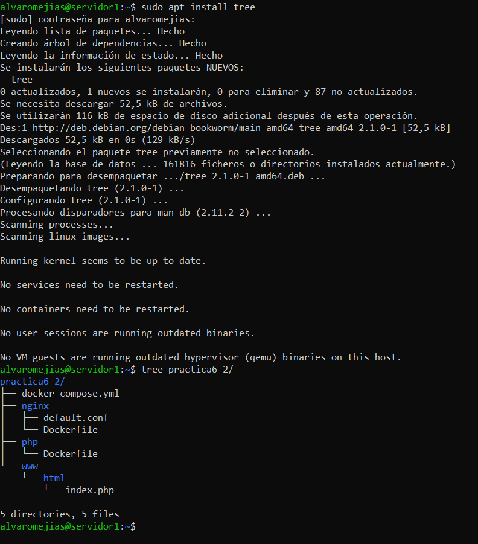

Así pues, la creamos:

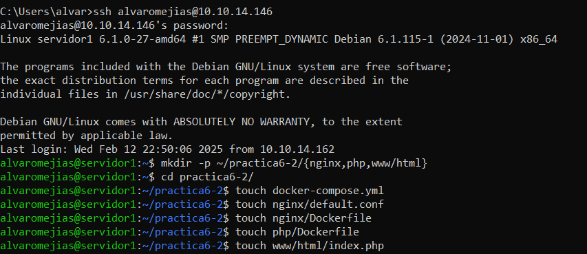

## Creación de un contenedor Nginx

En el archivo `docker-compose.yml` escribimos lo que se nos indica en el guión:

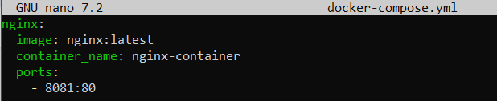
*Nota: he escogido ese puerto porque ya hay un servicio en activo en el puerto 80:80*

Y levantamos el contenedor:

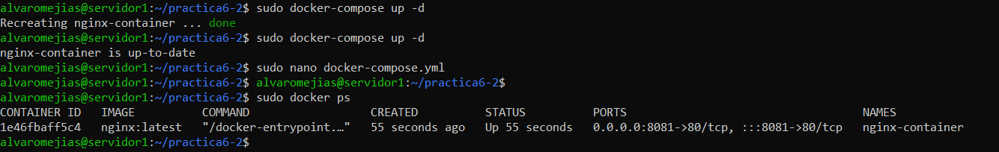

*Comprobación: `http://localhost:8081`*

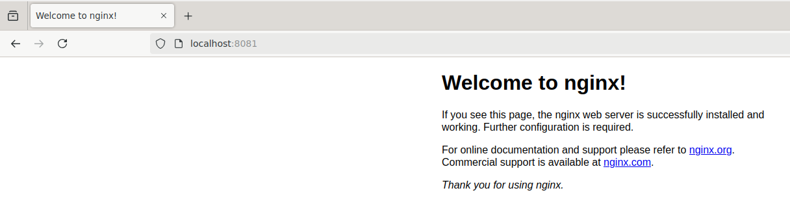

## Creación de un Contenedor PHP

Ahora tenemos que modificar los siguientes archivos:

1. `www/html/index.php`
2. `nginx/default.conf`
3. `nginx/Dockerfile`

En `www/html/index.php`, escribimos lo siguiente:

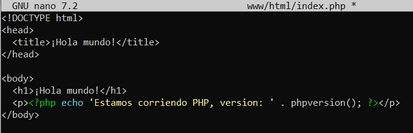

En `nginx/default.conf`:

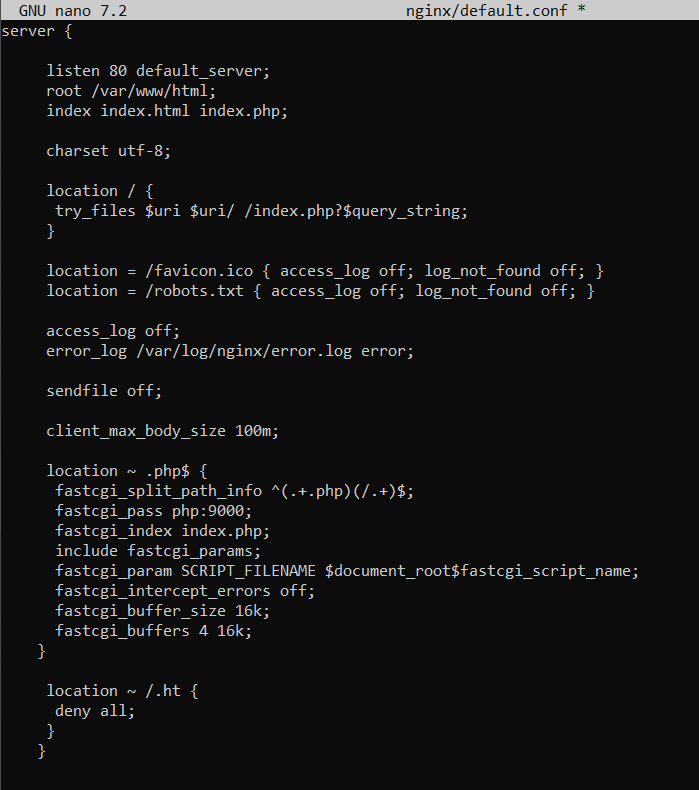

En `nginx/Dockerfile`:

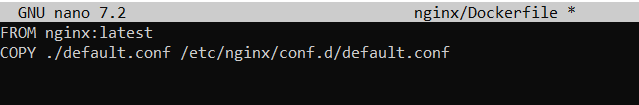

Tras esto modificamos el `docker-compose.yml`:

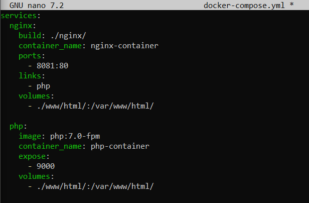

Y, de nuevo, levantamos el contenedor:

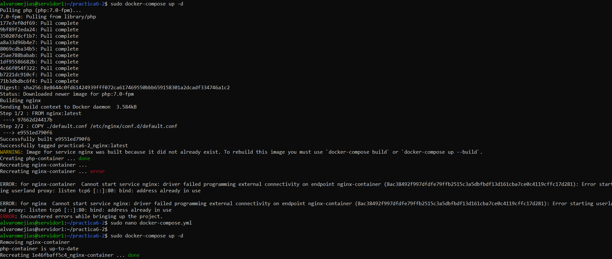
*Nota: El error que sale a mitad se debe a que tuve que cambiar de nuevo el puerto.*
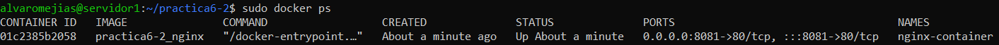

*Comprobación: `http://localhost:8081`*
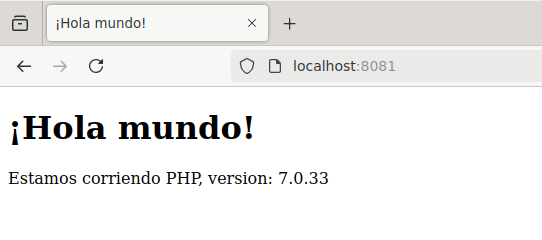

## Creación de un Contenedor para Datos

Modificamos de nuevo el `docker-compose.yml` y comprobamos que funciona al levantarlos:

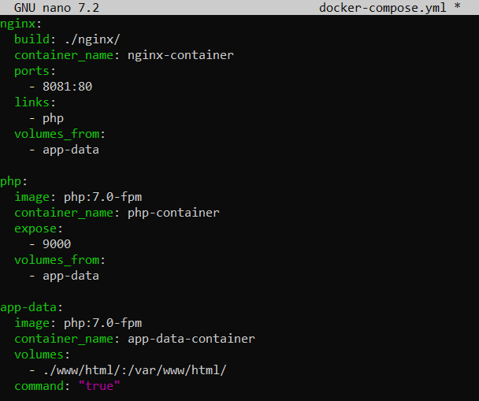

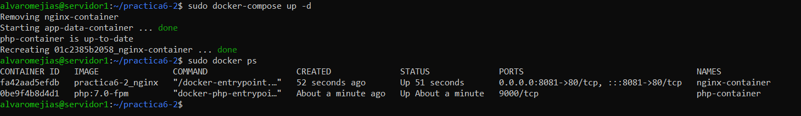

## Creación de un Contenedor MySQL

Escribimos en `php/Dockerfile` según el guión:

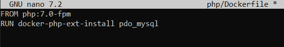

Y volvemos a editar el `docker-compose.yml`:

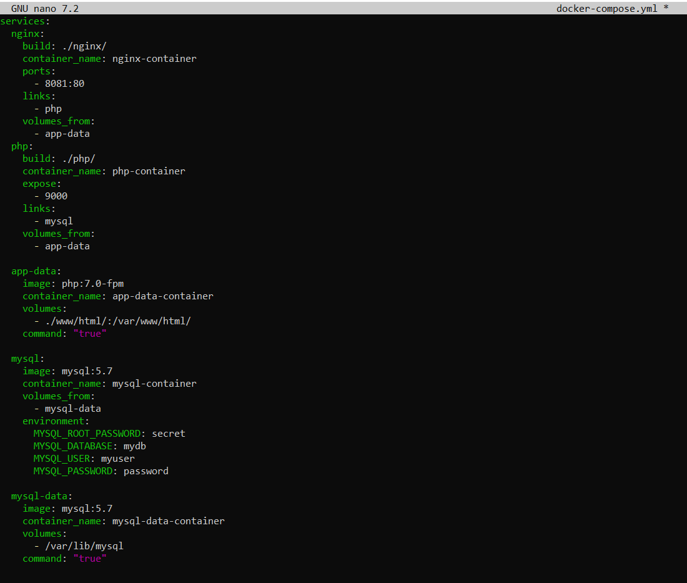

Y esta vez, escribimos en `www/html/index.php` lo siguiente:

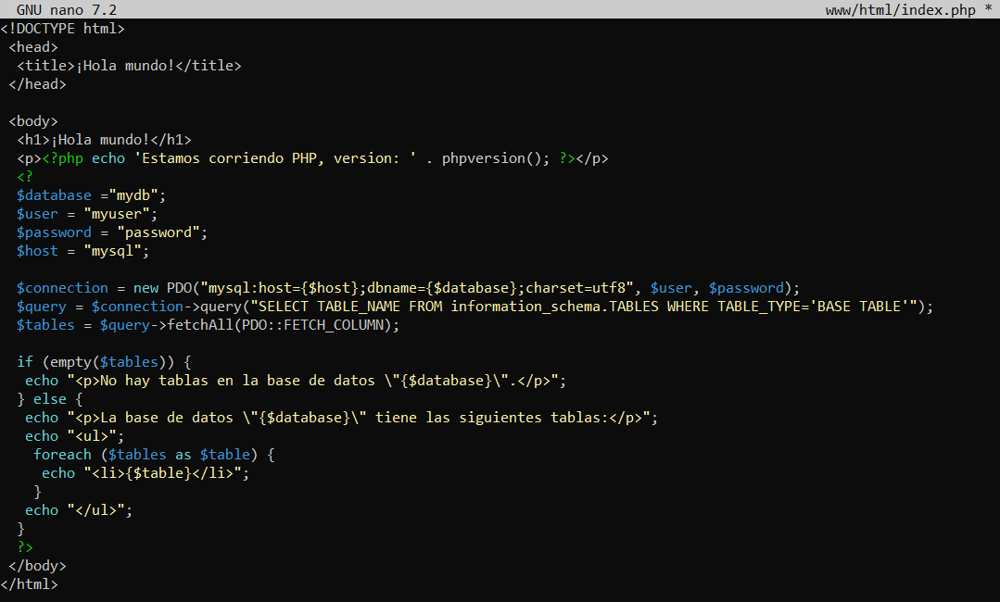

Otra vez, levantamos el contenedor:

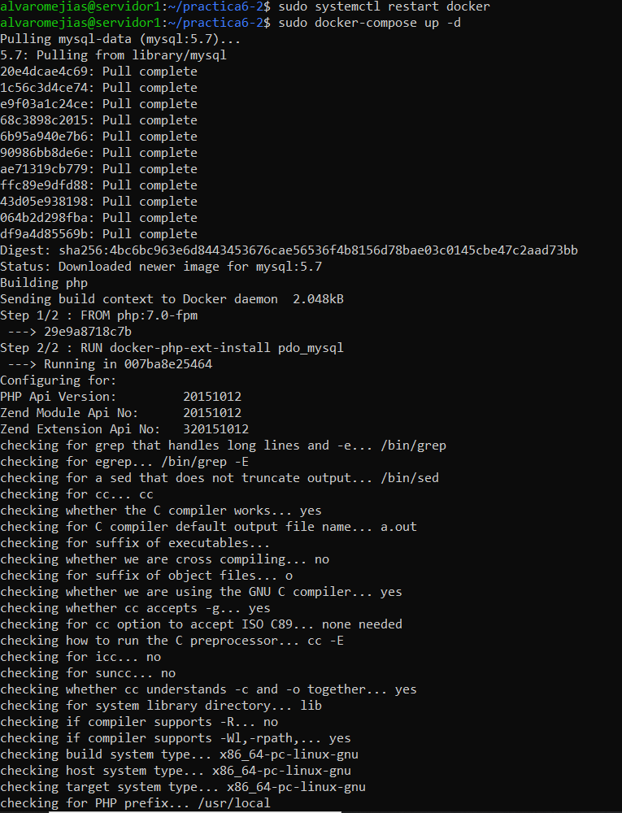
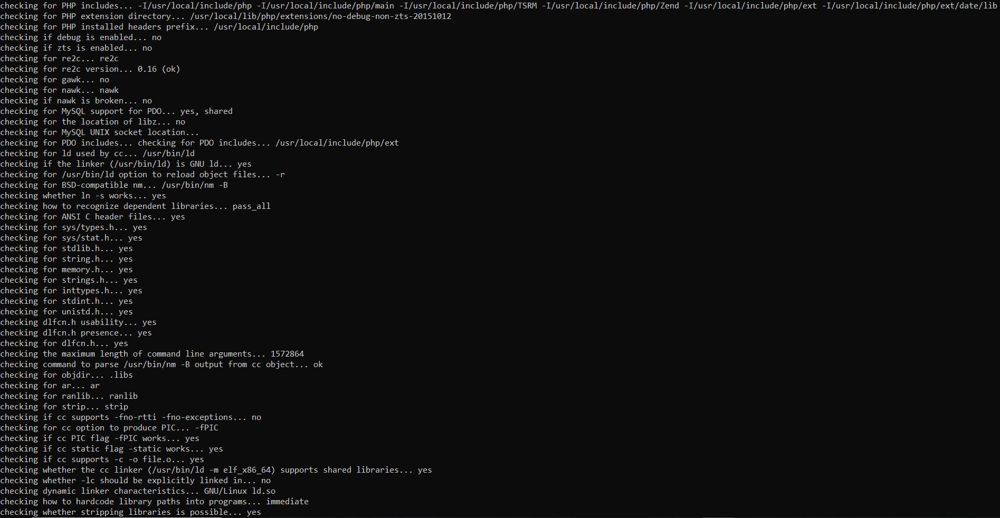
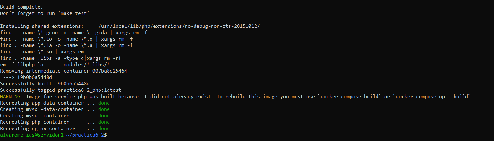

## Verificación de Conexión a la Base de Datos

*Comprobación: `http://localhost:8081`*
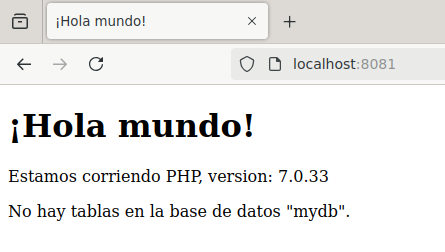

Para acceder a las tablas de la base de datos tenemos que poner en `www/html/index.php`:

```
$user = 'root';
$password = 'secret';
```

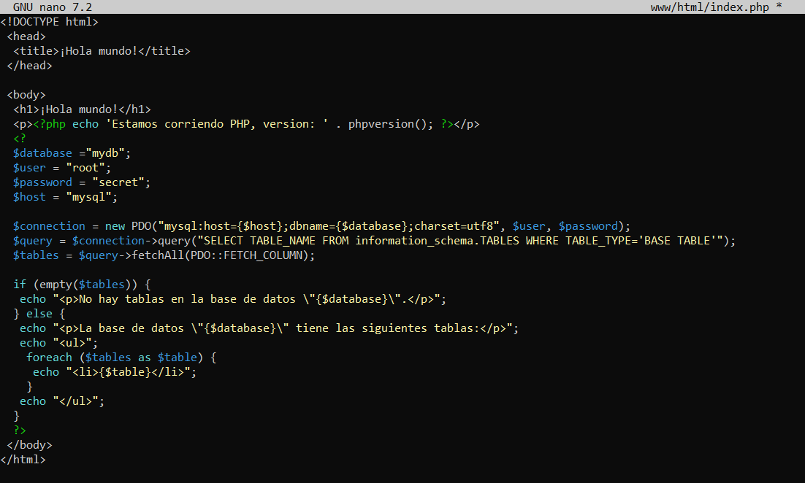

*Comprobación: `http://localhost:8081`*
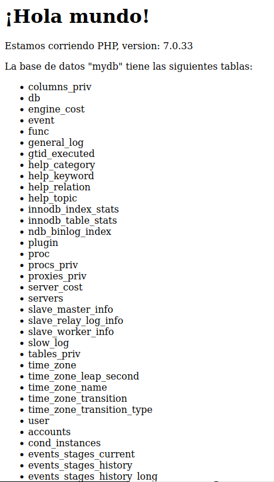